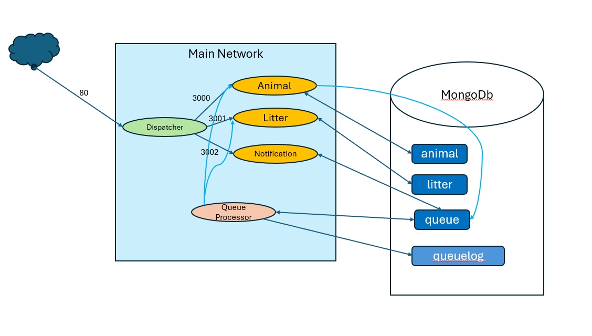
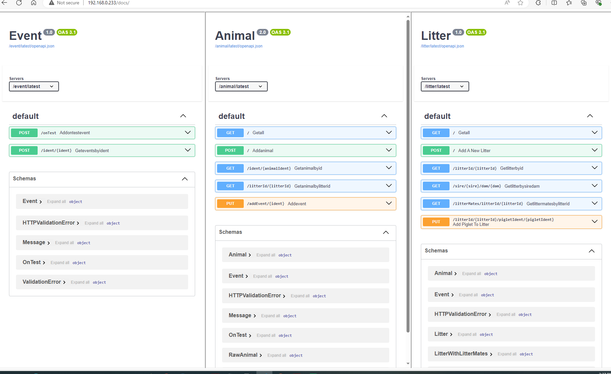

* 5 dockers
  * event api (api to access events)
  * animal api (api to access animals)
  * litter api (api to access litters)
  * notification api (api to add new queue)
  * queueprocessor (standalone, queue processor)
  * dispatcher accessor to the apis (nginx gateway, html and dispatching traffic to api's)

MVC not implemented in APIs

`commands.txt` shows all commands

cross service calls: 
* event.addontestEvent()
  * call animal.Getanimalbyid to validate animal exists
  * save event to event collection
  * (async) call animal.addEvent() 
* animal.AddAnimal()
  * save animal to animal collection
  * (async) call litter.AddPigletToLitter
* litter.getLitterMatesbyLitterId()
  * call animal.Getanimalbylitterid to get list of animals
* litter.addPigletToLitter()
  * call animal.Getanimalbyid to validate animal exists
  

Once implemented, http://HOSTNAME/docs should present the page with latest swagger 

