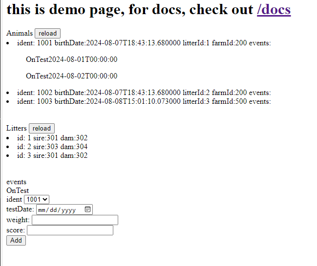

* Enviroment:
  * ubuntu 22.04.4 LTS
  * docker version 27.0.3 
  * mongodb version 4.4.15
  * a mongo database testDB is created
  * operating user belongs to docker group

* prototypes:
  * all components are deployed as docker containers
  * 3 micro services (animal, litter, event) only directly access corresponding database collections
  * cross micro-service communication can be performed 
    * synchronously - directly makes the api call
    * asynchronously - enqueue the task 
  * dispatcher docker is exposed to host at port 80
  * dispatcher contains main html/javascript contents
  * dispatcher redirect traffic to micro services depending on url's
  * queueprocessor handles 2 channels
    * apiFunctions: perform api calls enqueued by micro-services
    * scheduled: a demo that runs every x seconds depending on job's payload.delay
      * backfill/addScheduledJob.py adds the job to run every 120 seconds
  * apiFunctions.py (apiFunctions_docker.py) is being generated by generateApiFunction.py
    * the generater looks up config and calls each micro service's swagger document and generate functions to perform api calls
  * dispatcher config is being generated by generateNginxConf.py from config.

-----
DETAILS:
* 6 docker images ( each api images is used by 2 containers )
  * event api (api to access events) (containers event1 event2)
  * animal api (api to access animals) (containers animal1 animal2)
  * litter api (api to access litters) (containers litter1 litter2)
  * notification api (api to add new queue) (containers notification1 notification2)
  * queueprocessor (standalone, queue processor)
  * dispatcher accessor to the apis (nginx gateway, html and dispatching traffic to api's)

MVC can be implemented in APIs

`commands.txt` shows all commands

cross service calls: 
* event.addontestEvent()
  * call animal.Getanimalbyid to validate animal exists
  * save event to event collection
  * (async) call animal.addEvent() 
* animal.AddAnimal()
  * save animal to animal collection
  * (async) call litter.AddPigletToLitter
* litter.getLitterMatesbyLitterId()
  * call animal.Getanimalbylitterid to get list of animals
* litter.addPigletToLitter()
  * call animal.Getanimalbyid to validate animal exists
  

Once implemented, http://HOSTNAME/ should present demo page

it allows add event to animal 

to add animal/litters use swagger http://HOSTNAME/docs

