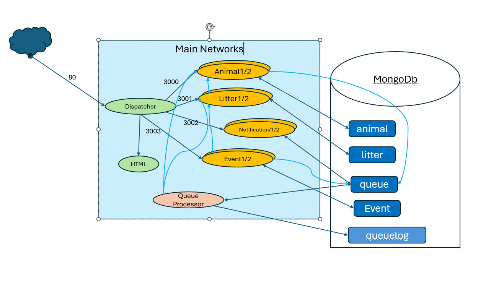

* 5 dockers
  * animal api (api to access animals)
  * litter api (api to access litters)
  * notification api (api to add new queue)
  * queueprocessor (standalone, queue processor)
  * dispatcher accessor to the apis (nginx gateway, html and dispatching traffic to api's)

MVC not implemented in APIs

`commands.txt` shows all commands

api calls: 
* animal.AddAnimal()
  * (async) call litter.AddPigletToLitter
* litter.getLitterMatesbyLitterId()
  * call animal.Getanimalbylitterid
* litter.addPigletToLitter()
  * call animal.Getanimalbyid

